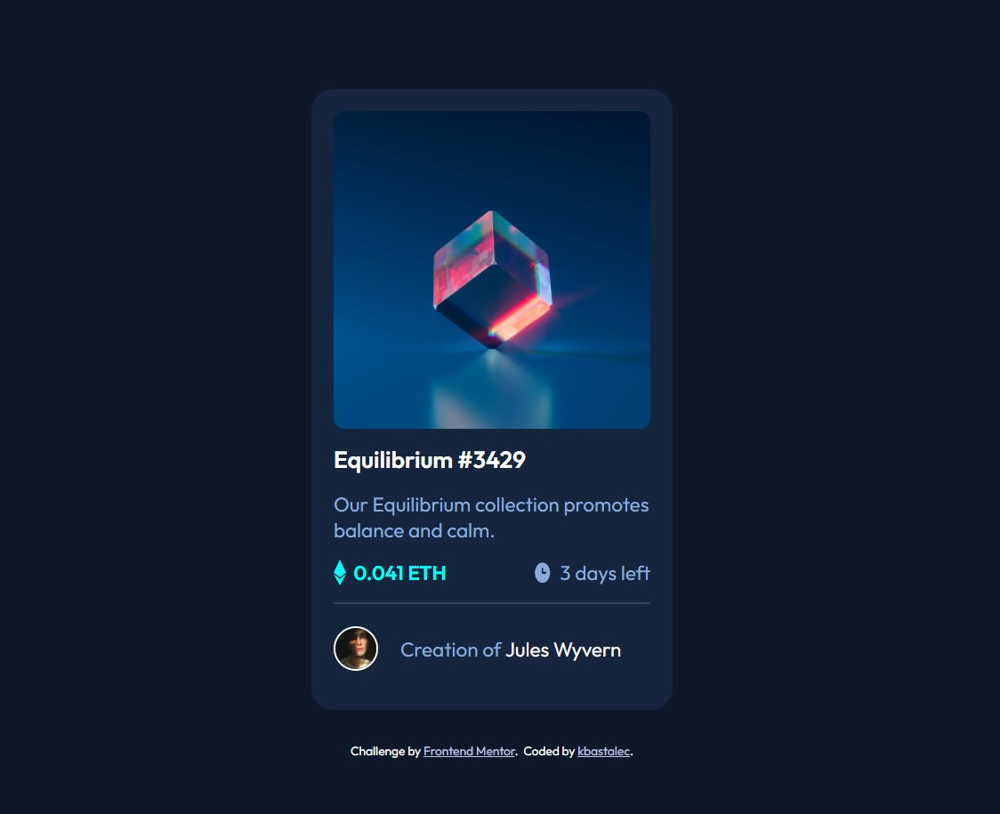

# Frontend Mentor - NFT preview card component solution

This is a solution to the [NFT preview card component challenge on Frontend Mentor](https://www.frontendmentor.io/challenges/nft-preview-card-component-SbdUL_w0U). Frontend Mentor challenges help you improve your coding skills by building realistic projects.

## Table of contents

- [Overview](#overview)
  - [The challenge](#the-challenge)
  - [Screenshot](#screenshot)
  - [Links](#links)
- [My process](#my-process)
  - [Built with](#built-with)
  - [What I learned](#what-i-learned)
  - [Useful resources](#useful-resources)
- [Author](#author)

## Overview

### The challenge

Users should be able to:

- View the optimal layout depending on their device's screen size
- See hover states for interactive elements

### Screenshot



### Links

- Solution URL: [Solution](https://github.com/kbastalec/nft-preview-card-component)
- Live Site URL: [Live](https://kbastalec.github.io/nft-preview-card-component/)

## My process

### Built with

- Semantic HTML5 markup
- CSS custom properties
- Flexbox
- Desktop-first workflow

### What I learned

I brushed my knowledge on [position property](https://www.w3schools.com/css/css_positioning.asp), particularly

```css
.class {
  position: relative;
}
```

and

```css
.class {
  position: absolute;
}
```

### Useful resources

- [Image Overlay](https://www.w3schools.com/howto/howto_css_image_overlay_title.asp) - This helped me set up the overlay effect on mouse hover

## Author

- Github - [kbastalec](https://github.com/kbastalec)
- Frontend Mentor - [@kbastalec](https://www.frontendmentor.io/profile/kbastalec)
